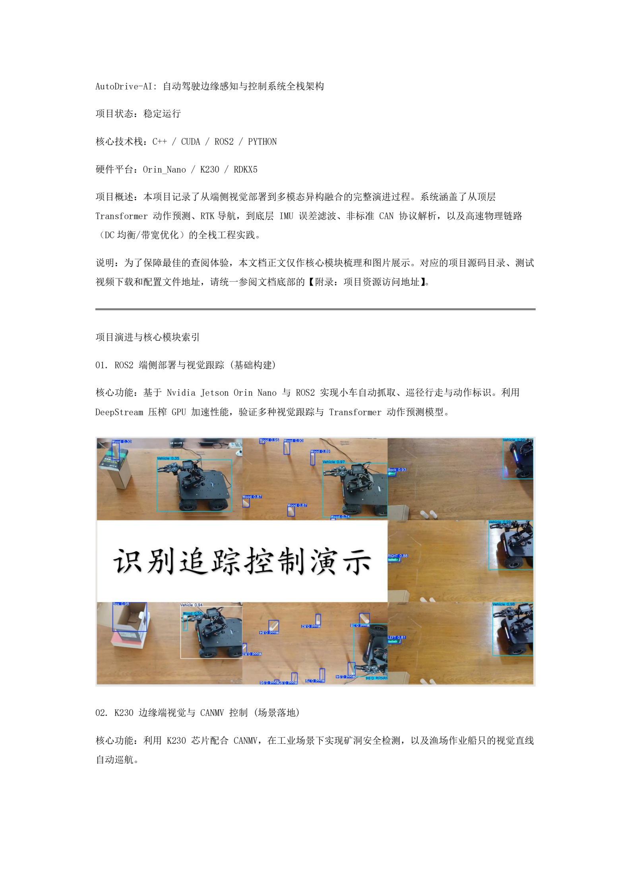
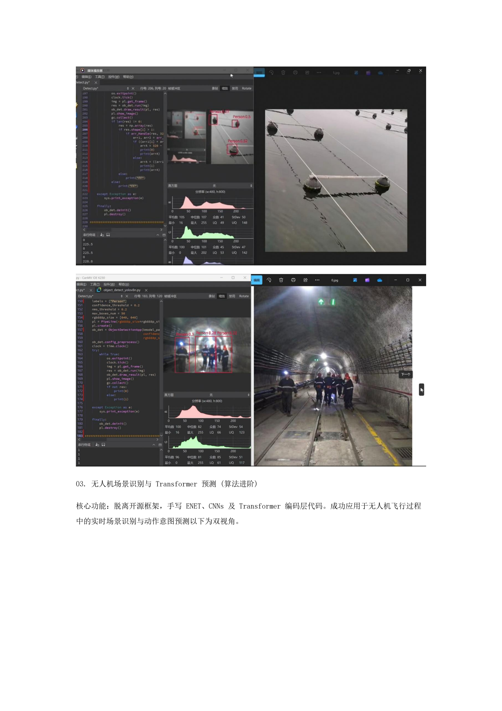
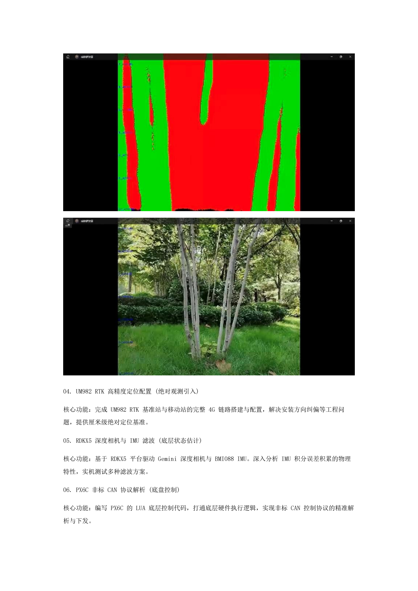
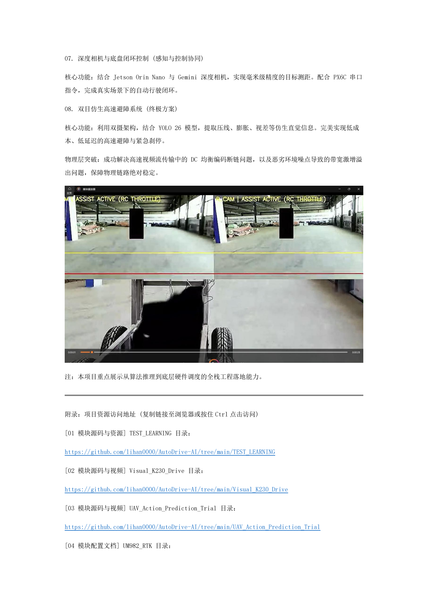
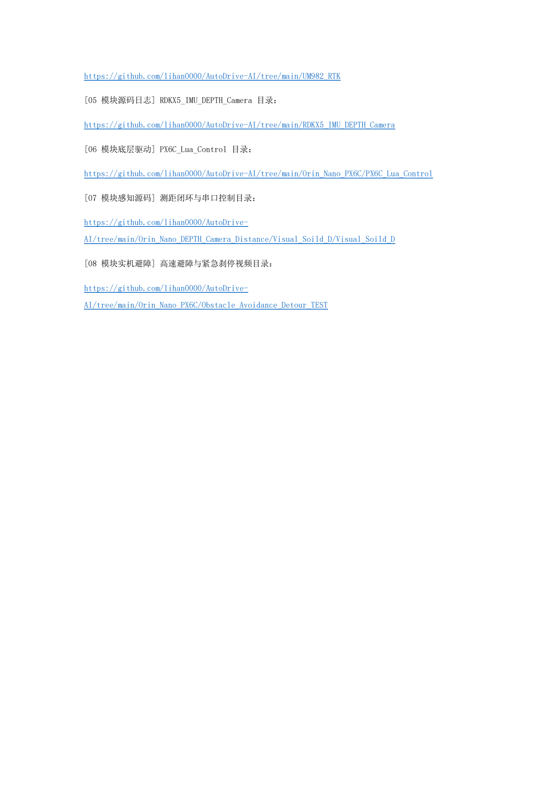

# AutoDrive-AI:自动驾驶边缘感知与控制系统全栈架构

   

> 📥 **核心资源入口**：
> * [📄 点击跳转查阅：本项目技术文档原件 (Word版)](./)
> * [🔗 跳转：底部的源码视频下载索引区](#附录项目资源与源码直达索引)

---

## 📖 技术架构详述

  
  
  
  
  

---

<h2 id="附录项目资源与源码直达索引">🔗 附录：项目资源与源码直达索引</h2>

*(点击下方链接，可直接跳转至对应目录查阅源码或下载实机测试视频)*

| 模块编号 | 核心技术模块名称 | 源码与实况资源直达 (GitHub 目录跳转) |
| :---: | :--- | :--- |
| **01** | **ROS2  端侧部署与视觉跟踪** | [👉 点击进入 TEST_LEARNING 目录](./TEST_LEARNING) |
| **02** | **K230  边缘端视觉场景落地** | [👉 点击进入 Visual_K230_Drive 目录](./Visual_K230_Drive) |
| **03** | **UAV   场景识别与算法进阶** | [👉 点击进入 UAV_Action_Prediction_Trial 目录](./UAV_Action_Prediction_Trial) |
| **04** | **RTK   高精度定位配置** | [👉 点击进入 UM982_RTK 目录](./UM982_RTK) |
| **05** | **RDKX5 深度相机与 IMU 控制** | [👉 点击进入 RDKX5_IMU_DEPTH_Camera 目录](./RDKX5_IMU_DEPTH_Camera) |
| **06** | **PX6C CAN 协议底层控制** | [👉 点击进入 PX6C_Lua_Control 目录](./Orin_Nano_PX6C/PX6C_Lua_Control) |
| **07** | **深度相机与底盘感知控制协同** | [👉 点击进入 Visual_Soild_D 核心目录](./Orin_Nano_DEPTH_Camera_Distance/Visual_Soild_D/Visual_Soild_D) |
| **08** | **双目仿生高速避障与紧急刹停** | [👉 点击进入 Obstacle_Avoidance_Detour 目录](./Orin_Nano_PX6C/Obstacle_Avoidance_Detour_TEST) |

---
